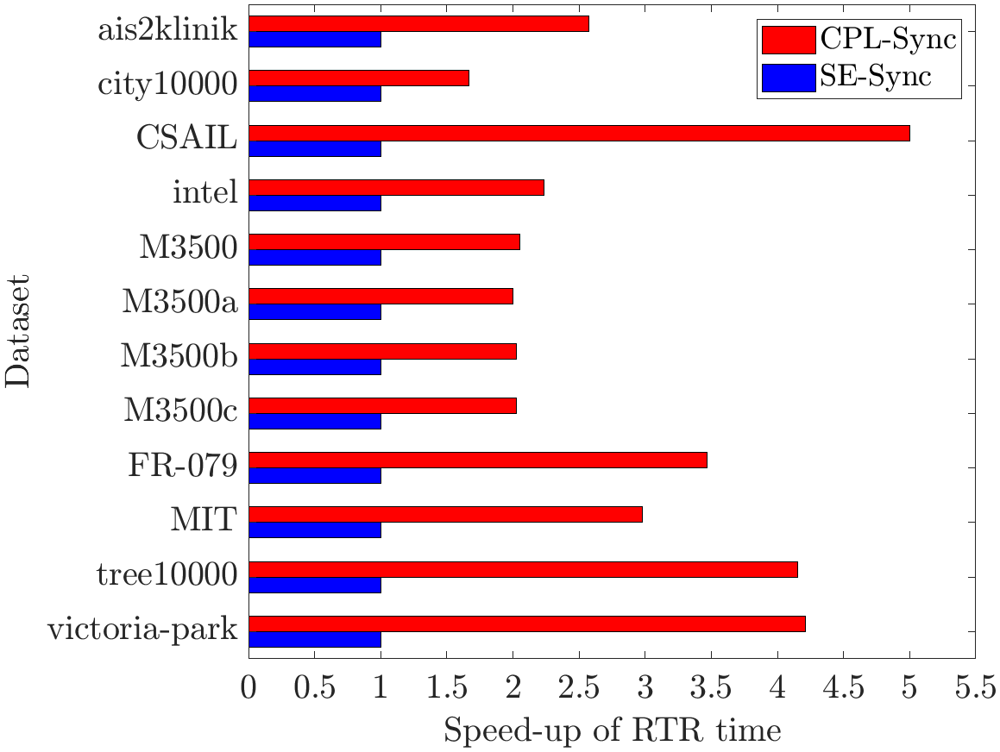
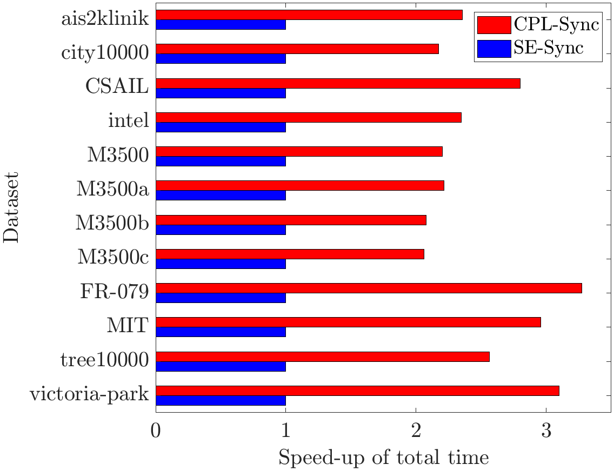

>**Note**: It is important to use our provided [Eigen](./C++/Eigen) library or [CholmodSupport.h](./C++/Eigen/Eigen/src/CholmodSupport/CholmodSupport.h) when compiling CPL-SLAM.

# CPL-SLAM

**CPL-SLAM** is an *efficient and certifiably correct* algorithm that solves planar graph-based SLAM using the complex number representation.

This repository features 2 algorithms
- [SE-Sync](https://github.com/david-m-rosen/SE-Sync): a certifiably correct algorithm for performing synchronization over the special Euclidean group.

- CPL-SLAM:  a certifiably correct algorithm for performing graph-based SLAM *with and without landmarks* using the *complex number representation*.

The performance comparison of  SE-Sync and CPL-SLAM on planar PGO is shown as follows:

  

# Getting Started
>**Note**: It is important to use our provided [Eigen](./C++/Eigen) library or [CholmodSupport.h](./C++/Eigen/Eigen/src/CholmodSupport/CholmodSupport.h) when compiling CPL-SLAM.

The C++ implementation of CPL-SLAM can be built and exported as a CMake project. For a minimal working example, see [examples/cpl_slam](./C++/examples/cpl_slam.cpp), which provides a simple command-line utility for processing .g2o files.

## Copyright and License 

The C++ implementations of CPL-SLAM contained herein are copyright (C) 2018 - 2019 by Taosha Fan, and are distributed under the terms of the GNU Lesser General Public License (LGPL) version 3 (or later).  Please see the [LICENSE](./LICENSE) for more information.

Contact: taosha.fan@gmail.com, hanlinwang@u.northwestern.edu
